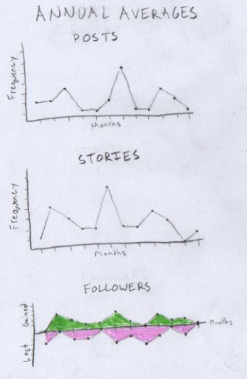
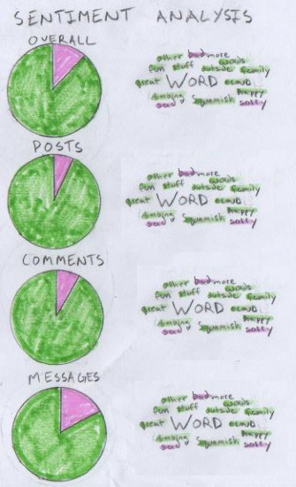
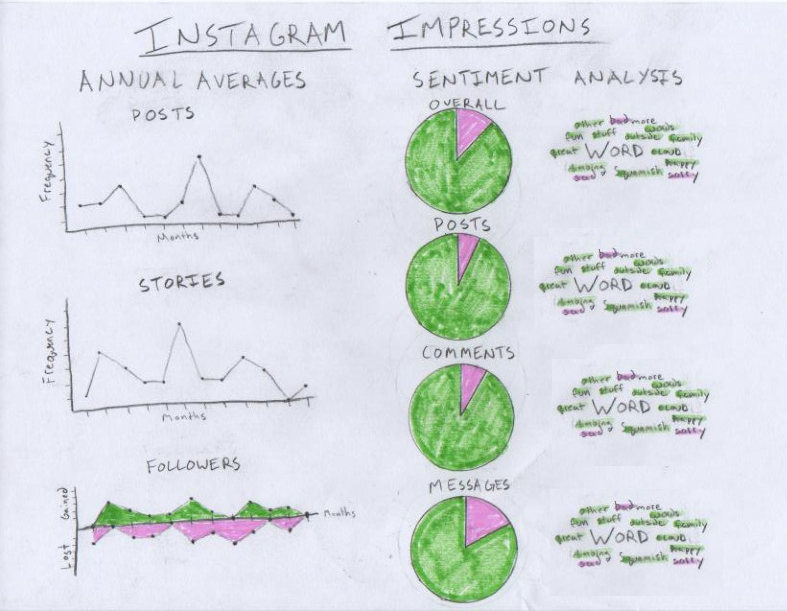

```{r setup, include=FALSE}
knitr::opts_chunk$set(echo = TRUE)
knitr::opts_chunk$set(root.dir = '/home/tyler/School/INSH5302/MyDigitalShaow/ConceptSketch')
```

## Description of Data Obtained

The data I obtained is from my Instagram account [\@monkeyman_90](https://www.instagram.com/monkeyman_90/). This data is stored in JSON files and contains various comprehensive information such as:

* Comments you’ve made to friends’ pictures and replies to comments they’ve made on yours
* When you started following other Instagram users and when other Instagram users started following you
* When you liked content from different users
* When you posted content to Instagram
* All of the messages you’ve sent to other users using Instagram’s mobile apps
* Your profile information
* Searches you’ve made

## Concept Sketch Breakdown

See the attached poster-sketch.pdf file or Fig. 4 on the last page of this report for the full poster sketch.

The overall color scheme will obviously not be bright green and pink but these were the only highlighter colors I had handy at the time of making the sketch. I will likely go for a color scheme that reflects the Instagram brand color scheme.

{width=20%}

### Annual Averages

My first idea was to break down my "post" and "story" history by month to see around what time of year I post the most. I have almost 4 years of data but I am not a huge poster so I thought it would be best to average this data on a per month basis.

I also thought it would be interesting to see if there is any correlation with frequency of posting and new or lost followers so the third plot, seen below in Fig. 2, will line up with the other two in order to show any trends in the data.

{width=80%}

### Sentiment Analysis

The other major idea I had was to run some simple sentiment analysis on the text data from my Instagram. The break down of how I will visualize this can be seen in Fig. 3 below. There will be 4 groups of my text data analyzed, posts, comments, messages, and overall which is a combination of the former three. Each group will have a pie chart showing the overall proportions and a word cloud of common words scaled by their frequency and colored by their individual sentiment value. After my initial sketch I realized there is a third category of neutral that I failed to illustrate which will get its own color as well.

{width=60%}

{width=100%}