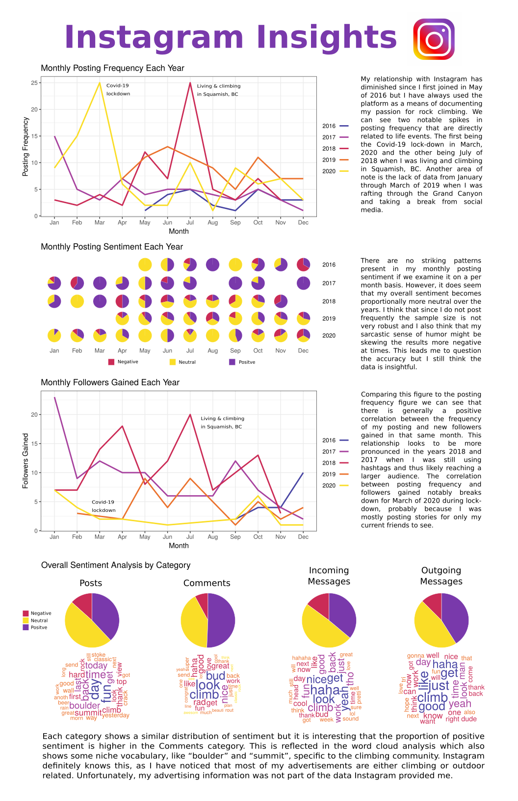

# Instagram Insights

The following markdown reports document the data analysis workflow.

- [Wrangling Data](wrangling-data.md)
- [Time Series Plots](time-series-plots.md)
- [Word Clouds and Sentiment Analysis](sentiment-analysis.md)

For this project I wanted to explore the data I have generated through my use of the social media platform Instagram. This project provided me a chance to practice my data wrangling and visualization skills. I highlight trends in my posting history and explore the textual data I have generated with word clouds and sentiment analysis.

Check out the poster below that summarizes my findings.

