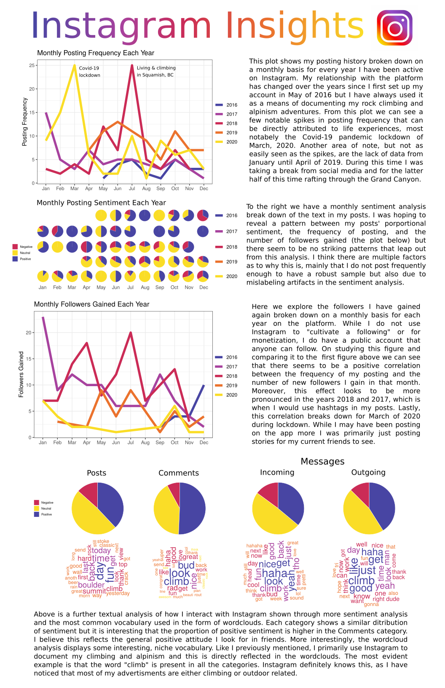

# Instagram Insights

For this project I wanted to explore the data I have generated through my use of the social media platform Instagram. This pet project provided me a chance to practice my data wrangling and visualization skills. Since I am not a prolific user of the platform I thought it would be more meaningful to explore the textual data I have generated with each post, comment, and message. To do this I created word clouds of the most common language used by me and my friends and also performed sentiment analysis on the text data via the syuzhet, bing, and afinn methods available in the syuzhet package.

The following reports document all the heavy lifting

- [Wrangling Data](wrangling-data.html)
- [Time Series Plots](time-series.plots.html)
- [Word Clouds and Sentiment Analysis](sentiment-analysis.html)

Check out the poster below for the finished product.

