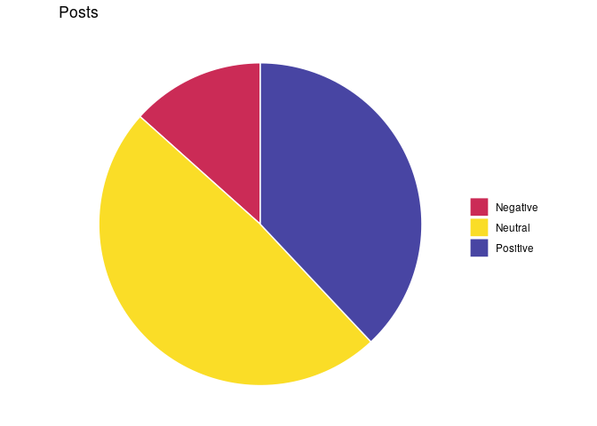
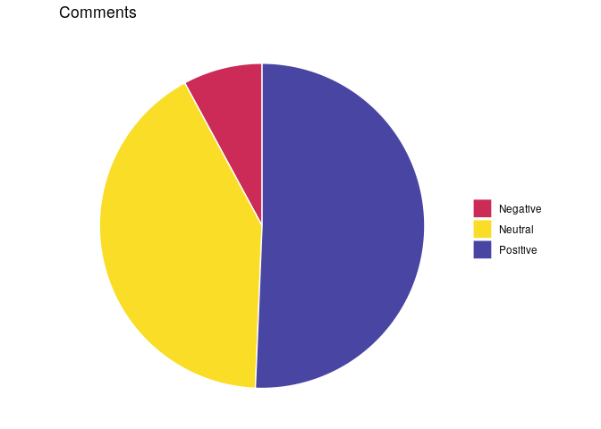
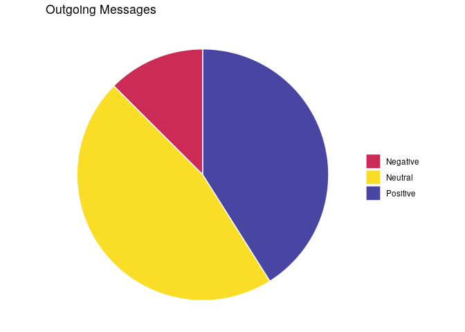
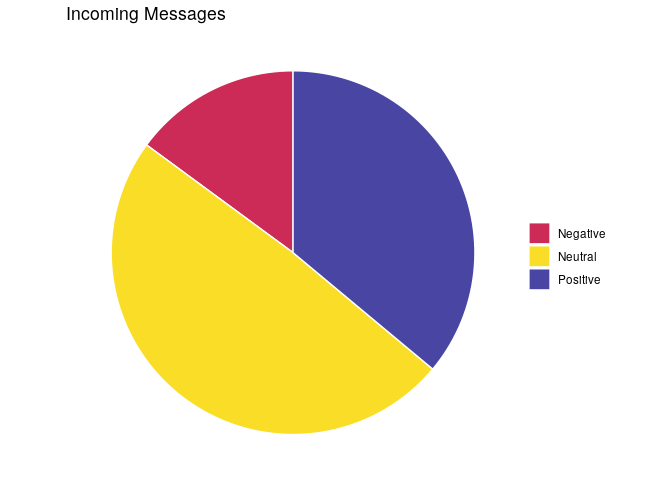

Word Clouds and Sentiment Analysis
================
Tyler Hill
2/12/2021

-----

``` r
# Load all necessary libraries
library(tidyverse)
library(tm)
library(SnowballC)
library(wordcloud)
library(syuzhet)
library(webshot)

# Load in the wrangled data
data_f <- file.path(".", "data.RData")
load(data_f)
```

# Word Clouds

In order to do make word clouds we will need to collect our text data in
a “Corpus” for the package “tm” to work with. From there we will need to
do some further cleaning of our data for the analysis. This includes
converting all characters to lowercase, removing hastags, usernames,
[stopwords](https://en.wikipedia.org/wiki/Stop_word), numbers,
punctuation, and any extra white space. We also want to perform [text
stemming](https://en.wikipedia.org/wiki/Stemming) which will reduce
words to their root form (ie. stemming to stem). We will do this for
df\_comments, df\_followers, and df\_messages data. We will first make a
generic function for the cleaning and then use it on each textual
observation in each df as well as the entirety of the text in a df.

``` r
clean_text <- function(text) {
  # Remove emojis, hashtags, and usernames
  text <- gsub("[^[:ascii:]]|#[^\\s]*|@[^\\s]*", "", text, perl=T)
  # Create Corpus object
  text_corp <- Corpus(VectorSource(text))

  # COnvert to lowercase
  text_corp <- tm_map(text_corp, content_transformer(tolower))
  # Remove numbers, stopwords, and punctuation
  text_corp <- tm_map(text_corp, removeNumbers)
  text_corp <- tm_map(text_corp, removeWords, stopwords("english"))
  text_corp <- tm_map(text_corp, removePunctuation)
  # Custom stopwords (erie is the name of a mountain I climb at)
  text_corp <- tm_map(text_corp, removeWords, c("erie")) 
  # Strip whitespace
  text_corp <- tm_map(text_corp, stripWhitespace)
  # Perform word stemming
  text_corp <- tm_map(text_corp, stemDocument)
  
  return(text_corp)
}
```

## Comments

Let’s use our function to clean the entirety of the comments text data

``` r
text <- paste(df_comments$comment, collapse = " ")

text_corp <- clean_text(text)
```

Now lets examine the frequency of common words by building a Documnet
Matrix with the tm package.

``` r
# Build Document Matrix
text_dm <- TermDocumentMatrix(text_corp)
dm <- as.matrix(text_dm)
# Sort by descending value
dm_v <- sort(rowSums(dm),decreasing=TRUE)
comments_dm_df <- data.frame(word = names(dm_v),freq=dm_v)
# Display the top 5 most frequent words
head(comments_dm_df, 10)
```

    ##        word freq
    ## look   look   27
    ## climb climb   25
    ## bud     bud   23
    ## nice   nice   20
    ## good   good   16
    ## haha   haha   16
    ## rad     rad   16
    ## get     get   14
    ## great great   14
    ## like   like   14

Now let’s look at its word cloud.

``` r
# Set a color palette to use that reflects Instagrams brand
col_pal_5 <- rev(c("#4845A3", "#A7429E", "#CB2B56", "#EB722D", "#FADD27"))
col_pal_12 <- c("#F92727", "#F93E27", "#F95527", "#F96B27", "#FA8227", "#FA9927", "#FAB027", "#FAC627", "#FADD27", "#766BAA", "#5C55C5", "#413EDF")

# Set a random seed so word clouds will look the same each rendering
set.seed(651990)

# Make and save the word cloud
pdf("./Plots/wordcloud-comments.pdf", width=12, height=8)
wordcloud(words = comments_dm_df$word, freq = comments_dm_df$freq, min.freq = 5, max.words=35, random.order=FALSE, rot.per=0.40, colors=col_pal_5)
```

## Posts

We’ll use the same method from above to generate the word cloud for the
posts data.

``` r
text <- paste(df_posts$caption, collapse = " ")

text_corp <- clean_text(text)

# Build Document Matrix
text_dm <- TermDocumentMatrix(text_corp)
dm <- as.matrix(text_dm)
# Sort by descending value
dm_v <- sort(rowSums(dm),decreasing=TRUE)
posts_dm_df <- data.frame(word = names(dm_v),freq=dm_v)
# Display the top 5 most frequent words
head(posts_dm_df, 10)
```

    ##            word freq
    ## day         day   28
    ## fun         fun   28
    ## time       time   22
    ## back       back   21
    ## boulder boulder   18
    ## today     today   18
    ## get         get   17
    ## last       last   17
    ## summit   summit   16
    ## climb     climb   15

``` r
# Set a random seed so word clouds will look the same each rendering
set.seed(651990)

# Make and save the word cloud
pdf("./Plots/wordcloud-posts.pdf", width=12, height=8)
wordcloud(words = posts_dm_df$word, freq = posts_dm_df$freq, min.freq = 5, max.words=35, random.order=FALSE, rot.per=0.40, colors=col_pal_5)

# Save the wordcloud
```

## Messages

We’ll use the same method again to generate the word cloud for the
messages data. First we will look at a word cloud built from messages I
sent.

``` r
outgoing <- df_messages %>%
  filter(sender == "Tyler Hill") %>%
  select(message)

text <- paste(outgoing, collapse = " ")

text_corp <- clean_text(text)

# Build Document Matrix
text_dm <- TermDocumentMatrix(text_corp)
dm <- as.matrix(text_dm)
# Sort by descending value
dm_v <- sort(rowSums(dm),decreasing=TRUE)
messages_dm_df <- data.frame(word = names(dm_v),freq=dm_v)
# Display the top 5 most frequent words
head(messages_dm_df, 10)
```

    ##        word freq
    ## haha   haha  132
    ## look   look  117
    ## yeah   yeah  114
    ## get     get  109
    ## nice   nice  108
    ## climb climb  104
    ## fun     fun   96
    ## tho     tho   95
    ## just   just   92
    ## back   back   90

``` r
# Set a random seed so word clouds will look the same each rendering
set.seed(651990)

# Make and save the word cloud
pdf("./Plots/wordcloud-msg-out.pdf", width=12, height=8)
wordcloud(words = messages_dm_df$word, freq = messages_dm_df$freq, min.freq = 5, max.words=35, random.order=FALSE, rot.per=0.40, colors=col_pal_5)
```

Now lets look at a word cloud built from messages I have received.

``` r
incoming <- df_messages %>%
  filter(sender != "Tyler Hill") %>%
  select(message)

text <- paste(incoming, collapse = " ")

text_corp <- clean_text(text)

# Build Document Matrix
text_dm <- TermDocumentMatrix(text_corp)
dm <- as.matrix(text_dm)
# Sort by descending value
dm_v <- sort(rowSums(dm),decreasing=TRUE)
messages_dm_df <- data.frame(word = names(dm_v),freq=dm_v)
# Display the top 5 most frequent words
head(messages_dm_df, 10)
```

    ##        word freq
    ## just   just  139
    ## climb climb  136
    ## like   like  135
    ## get     get  129
    ## good   good  124
    ## haha   haha  116
    ## yeah   yeah  105
    ## time   time   96
    ## day     day   93
    ## look   look   89

``` r
# Set a random seed so word clouds will look the same each rendering
set.seed(651990)

# Make and save the word cloud
pdf("./Plots/wordcloud-msg-in.pdf", width=12, height=8)
wordcloud(words = messages_dm_df$word, freq = messages_dm_df$freq, min.freq = 5, max.words=35, random.order=FALSE, rot.per=0.40, colors=col_pal_5)
```

# Sentiment Analysis

For the sentiment analysis we will first add a column called cleaned
that has any hashtags or usernames removed. We will then use the syuzhet
package to perform three different methods of sentiment analysis,
syuzhet, bing, and afinn. Each of these methods produces either a
positive value if the sentiment is overall postivie, a negative value
for a negative sentiment, and 0 if the sentiment is neutral. We will add
a column named consensus with three factors, 1, 0, and -1, that
corresponds to a consensus sentiment between these three methods.

``` r
# Function to find the consensus sentiment
consensus_func <- function(df) {
  # Iterate through the df
  for (i in 1:nrow(df)) {
    
    # Track the consensus
    positive <- 0
    negative <- 0
    neutral <- 0
    for (x in c("syuzhet", "bing", "afinn")) {
      if (df[i, x] > 0) {
        positive <- positive + 1
      } else if (df[i, x] < 0) {
        negative <- negative + 1
      } else {
        neutral <- neutral + 1
      }
    }
    
    # Score the consensus
    if (positive >= 2) {
      df[i, "consensus"] <- "Positive"
    } else if (negative >= 2) {
      df[i, "consensus"] <- "Negative"
    } else {
      df[i, "consensus"] <- "Neutral"
    }
  }
  
  df$consensus <- as.factor(df$consensus)
  
  return(df)
}
```

## Posts

Let’s use the syuzhet package along with the function above to analyze
the posts data.

``` r
df_posts <- df_posts %>%
  mutate(cleaned = gsub("#[^\\s]*|@[^\\s]*", "", caption, perl=T)) %>%
  mutate(syuzhet = get_sentiment(cleaned, method="syuzhet")) %>%
  mutate(bing = get_sentiment(cleaned, method="bing")) %>%
  mutate(afinn = get_sentiment(cleaned, method="afinn"))

df_posts <- consensus_func(df_posts)

head(df_posts[c(2, 5:8)])
```

    ## # A tibble: 6 x 5
    ##   caption                                          syuzhet  bing afinn consensus
    ##   <chr>                                              <dbl> <int> <int> <fct>    
    ## 1 "Miss you too @annahill_author !\nLooking forwa…     0.6    -1    -2 Negative 
    ## 2 "Never gets old!"                                    0       0     0 Neutral  
    ## 3 "I made dis"                                         0       0     0 Neutral  
    ## 4 "I feel like a hamster in a wheel"                   0.5     1     2 Positive 
    ## 5 "Crack is back!"                                    -0.5    -1     0 Negative 
    ## 6 "Professional hype man"                              0.3    -1     0 Neutral

Let’s make a pie chart from the consensus data.

``` r
df_posts %>%
  select(consensus) %>%
  count(consensus) %>%
  ggplot() +
  aes(x="", y=n, fill=consensus) +
  geom_bar(stat="identity", width=1, color="white") +
  coord_polar("y", start=0) +
  theme_void() +
  theme(legend.title = element_blank()) +
  labs(title="Posts") +
  scale_fill_manual(values=c("Negative" = "#CB2B56", "Neutral" = "#FADD27", "Positive" = "#4845A3"))
```

<!-- -->

``` r
ggsave("sent-anal-posts.pdf", width = 6, height = 4, path="./Plots")
```

## Comments

We’ll use the same strategy to perform sentiment analysis on the
comments data.

``` r
df_comments <- df_comments %>%
  mutate(cleaned = gsub("#[^\\s]*|@[^\\s]*", "", comment, perl=T)) %>%
  mutate(syuzhet = get_sentiment(cleaned, method="syuzhet")) %>%
  mutate(bing = get_sentiment(cleaned, method="bing")) %>%
  mutate(afinn = get_sentiment(cleaned, method="afinn"))

df_comments <- consensus_func(df_comments)

df_comments %>%
  select(consensus) %>%
  count(consensus) %>%
  ggplot() +
  aes(x="", y=n, fill=consensus) +
  geom_bar(stat="identity", width=1, color="white") +
  coord_polar("y", start=0) +
  theme_void() +
  theme(legend.title = element_blank()) +
  labs(title="Comments") +
  scale_fill_manual(values=c("Negative" = "#CB2B56", "Neutral" = "#FADD27", "Positive" = "#4845A3"))
```

<!-- -->

``` r
ggsave("sent-anal-comments.pdf", width = 6, height = 4, path="./Plots")
```

## Messages

``` r
df_messages <- df_messages %>%
  mutate(cleaned = gsub("#[^\\s]*|@[^\\s]*", "", message, perl=T)) %>%
  mutate(syuzhet = get_sentiment(cleaned, method="syuzhet")) %>%
  mutate(bing = get_sentiment(cleaned, method="bing")) %>%
  mutate(afinn = get_sentiment(cleaned, method="afinn"))

df_messages <- consensus_func(df_messages)

# Pie chart of outgoing messages
df_messages %>%
  filter(sender == "Tyler Hill") %>%
  select(consensus) %>%
  count(consensus) %>%
  ggplot() +
  aes(x="", y=n, fill=consensus) +
  geom_bar(stat="identity", width=1, color="white") +
  coord_polar("y", start=0) +
  theme_void() +
  theme(legend.title = element_blank()) +
  labs(title="Outgoing Messages") +
  scale_fill_manual(values=c("Negative" = "#CB2B56", "Neutral" = "#FADD27", "Positive" = "#4845A3"))
```

<!-- -->

``` r
ggsave("sent-anal-msg-out.pdf", width = 6, height = 4, path="./Plots")

# Pie chart of incoming messages
df_messages %>%
  filter(sender != "Tyler Hill") %>%
  select(consensus) %>%
  count(consensus) %>%
  ggplot() +
  aes(x="", y=n, fill=consensus) +
  geom_bar(stat="identity", width=1, color="white") +
  coord_polar("y", start=0) +
  theme_void() +
  theme(legend.title = element_blank()) +
  labs(title="Incoming Messages") +
  scale_fill_manual(values=c("Negative" = "#CB2B56", "Neutral" = "#FADD27", "Positive" = "#4845A3"))
```

<!-- -->

``` r
ggsave("sent-anal-msg-in.pdf", width = 6, height = 4, path="./Plots")
```

``` r
# Clean work space
rm(text, dm_v, text_dm, text_corp, incoming, outgoing, dm, posts_dm_df, comments_dm_df, messages_dm_df, data_f, clean_text, consensus_func)

# Save workspace
save.image(file='data.RData')
```
