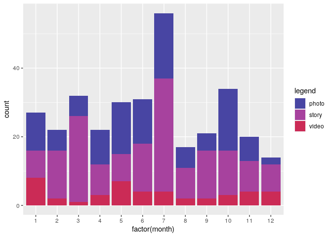
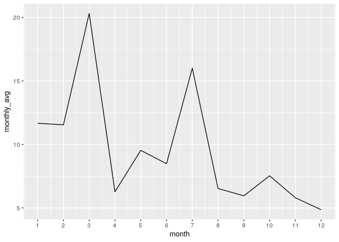
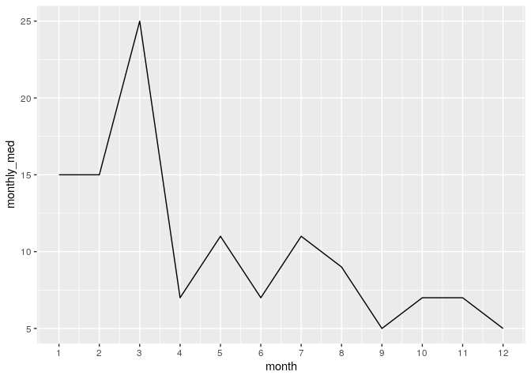
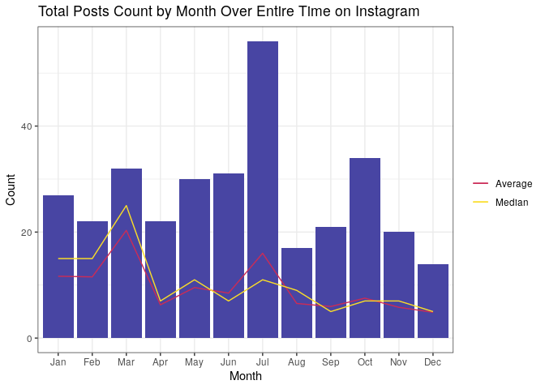
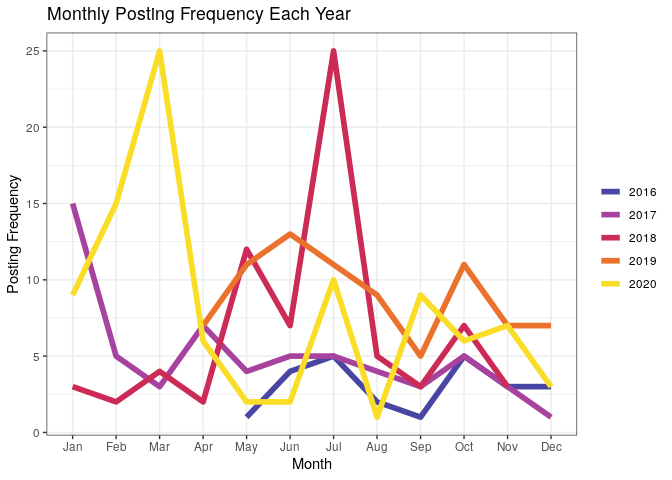
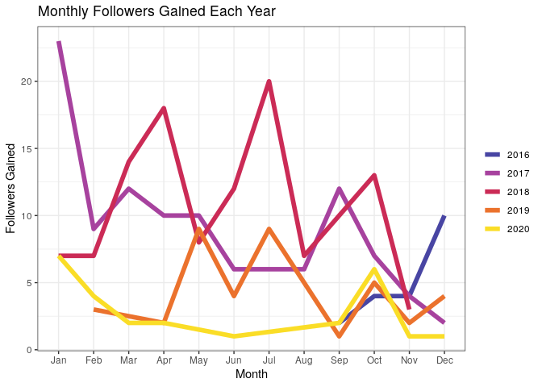

***


```r
# Load all necessary libraries
library(tidyverse)
library(lubridate)

# Load in the data
data_f <- file.path(".", "data.RData")
load(data_f)
```

# Monthly Statstics vs Overlaid Annual Posting Frequency by Month

I have been debating on the best method of visualizing my time series data as how I have interacted with Instagram has changed over the years. In the past I had lots of interaction with the platform when I was actively trying to gain followers but now I have much less interaction as I have started to care much less about my social media presence. I would like to find a method of visualizing this pattern and then maybe try to rework my sentiment analysis visualizations in a time-bound format to maybe reflect these findings.

Mt first idea was to average the posting frequency of each month throughout my five years or so on the platform so I will start here.

## Total Counts, Mean, and Median Posting Statistics by Month

First I will examine the total number of posts in a given month over my entire history on the platform grouped by the posting type.


```r
# Add a month and year column to df_posts
df_posts <- df_posts %>%
  mutate(month = month(date), year = year(date))

# Remove data from the year 2021 as there is very little of it to begin with
df_posts <- df_posts %>% 
  filter(year != 2021)

df_posts %>%
  select(month, type) %>%
  ggplot() +
  aes(x = factor(month), fill=type) +
  geom_bar() + 
  scale_fill_manual("legend", values = rev(col_pal_5))
```

<!-- -->

From the graph we can see I do most of my posting in July. I don't find this very surprising as that is a great month for rock climbing and I mainly use Instagram to document my climbing and interact with the community.

Let's see if this pattern remains after we take the average of each month throughout the years.


```r
# Select data only from full years 
df_month_avgs <- df_posts %>% 
  select(month, year, type) %>%
  group_by(year, month) %>% 
  summarise(monthly_counts = n(), type) %>%
  group_by(month) %>% 
  summarise(monthly_avg = mean(monthly_counts))

df_month_avgs %>% 
  ggplot() +
  aes(x = month, y = monthly_avg) +
  geom_line() +
  scale_x_continuous(breaks=1:12)
```

<!-- -->

From the plot above we get an interesting finding in that we now see that March is the month with the highest average posting frequency. Re-examining the first bar graph I generated we can see that March is indeed the next highest month in terms of overall counts. This must mean that there is one outlier year where I posted a lot in July.

Let's examine another line graph, this time comparing the median posting frequency by month.


```r
# Select data only from full years 
df_month_meds <- df_posts %>% 
  select(month, year, type) %>%
  group_by(year, month) %>% 
  summarise(monthly_counts = n(), type) %>%
  group_by(month) %>% 
  summarise(monthly_med = median(monthly_counts))

df_month_meds %>% 
  ggplot() +
  aes(x = month, y = monthly_med) +
  geom_line() + 
  scale_x_continuous(breaks=1:12)
```

<!-- -->

Here we can see even more how I am most likely to post to my Instagram in the month of March.

Let's overlay these three graphs to see if this makes the trend more apparent. I'll remove the fill by type to make the visualization less cluttered looking.


```r
df_monthly_stats <- merge(df_month_avgs, df_month_meds, by="month")

# Clean workspace
rm(df_month_avgs, df_month_meds)
```


```r
df_posts %>%
  select(month) %>%
  group_by(month) %>% 
  summarise(count = n()) %>% 
  ggplot() +
  aes(x = as.factor(month), y = count) +
  geom_col(fill="#4845A3") +
  geom_line(data = df_monthly_stats, aes(x = month, y = monthly_avg, color = "Average")) +
  geom_line(data = df_monthly_stats, aes(x = month, y = monthly_med, color = "Median")) + 
  scale_x_discrete(labels=month(1:12, label=T)) +
  scale_color_manual(values = c("#CB2B56", "#FADD27")) +
  theme_bw() +
  theme(legend.title=element_blank()) +
  labs(x = "Month",
       y ="Count",
       title = "Total Posts Count by Month Over Entire Time on Instagram")
```

<!-- -->

```r
ggsave("total-post-count-monthly.pdf", width = 6, height = 4, path="./Plots")
```

In my opinion this plot results in a nice summary of my likelihood to post in a given month while also showing a deeper story for the month of July in that there must have been a year where my posting habits changed quite drastically.

I'll examine my posting frequency by month on an annual basis next.

## Overlaid Annual Posting Frequency by Month

Here I will be showing the total posting frequencies per month of each year on a single plot with 5 overlaid line graphs from the years 2016 through 2020.


```r
df_posts %>%
  select(year, month) %>% 
  group_by(year, month) %>% 
  summarise(monthly_counts = n()) %>% 
  ggplot() +
  aes(x = as.factor(month), y = monthly_counts, group = as.factor(year), color = as.factor(year)) +
  geom_line(size = 2) +
  scale_x_discrete(labels=month(1:12, label=T)) +
  scale_color_manual(values=c("#4845A3", "#A7429E", "#CB2B56", "#EB722D", "#FADD27")) +
  theme_bw() +
  theme(legend.title=element_blank()) +
  labs(x = "Month",
       y ="Posting Frequency",
       title = "Monthly Posting Frequency Each Year")
```

<!-- -->

```r
ggsave("annual-post-freq.pdf", width = 6, height = 4, path="./Plots")
```

The above plot is probably the most informative yet as you can really see where there are local spikes in my posting history. As I should have guessed, the findings I previously uncovered are due to the extremely increased activity I had on Instagram during the initial Covid-19 lock-down in 2020. I think showing this plot first in my poster will have the largest impact and kickoff the story of the visual narrative that I can later explain a bit further with the second to last plot.  
 
## Gained Followers

Next I will plot my monthly gained followers grouped by year as well.


```r
# Add a month and year column to df_followers
df_followers <- df_followers %>%
  mutate(month = month(date), year = year(date)) %>% 
  filter(year != 2021)

df_followers %>% 
  select(year, month) %>% 
  group_by(year, month) %>% 
  summarise(monthly_counts = n()) %>% 
  ggplot() +
  aes(x = as.factor(month), y = monthly_counts, group = as.factor(year), color = as.factor(year)) +
  geom_line(size = 2) + 
  scale_x_discrete(labels=month(1:12, label=T)) +
  scale_color_manual(values=c("#4845A3", "#A7429E", "#CB2B56", "#EB722D", "#FADD27")) +
  theme_bw() +
  theme(legend.title=element_blank()) +
  labs(x = "Month",
       y ="Followers Gained",
       title = "Monthly Followers Gained Each Year")
```

<!-- -->

```r
ggsave("annual-followers-gained.pdf", width = 6, height = 4, path="./Plots")
```

This is an interesting outcome when compared to the previous plot because it shows that even though I was posting a lot in March of 2020 I didn't gain that many followers. This is contrasted by my spike in posting in July of 2018 where I also gained a lot of followers as well.

# Sentiment Analysis of Monthly Posting

To better flush out my visual story I wonder if I can spot any trends in the sentiment of my posts grouped by month. Am I more positive when I post more often or vice versa? Is there a spike in followers when my posts are more positive?


```r
for (y in 2016:2020) {
  for (m in 1:12) {
    ls_months <- df_posts %>% 
      filter(year == y) %>% 
      select(month) %>% 
      distinct()
    if (m %in% ls_months$month) {
      df_posts %>%
        filter(year == y, month == m) %>% 
        select(consensus) %>%
        count(consensus) %>%
        ggplot() +
        aes(x="", y=n, fill=consensus) +
        geom_bar(stat="identity", width=1, color="white") +
        coord_polar("y", start=0) +
        theme_void() +
        theme(legend.title = element_blank()) +
        labs(title=paste(y, m)) +
        scale_fill_manual(values=c("Negative" = "#CB2B56",
                                   "Neutral" = "#FADD27",
                                   "Positive" = "#4845A3"))
      
      ggsave(paste(y, "-", m, "-sentiment.pdf", sep = ""), width = 6, height = 4, path="./Plots/Monthly-Sentiment")
    }
  }
}
```


It is hard to see any trends without lining up these sentiment analysis plots with the time series plots from above but checking the plots for 2018-7 and 2020-3 we can see that the proportions of positive, neutral, negative sentiment are very similar between these high activity months. This might indicate that the sentiment analysis does not track well with followers gained.
